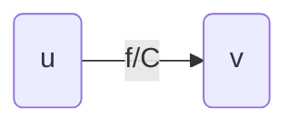
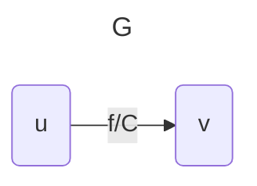
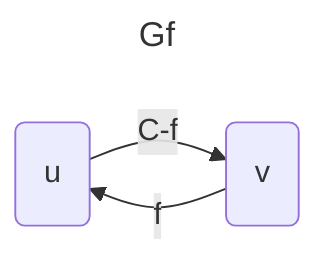

## 1. Definitions
**Flow Network**: a directed graph G = (V, E) with the following properties:
- All edges (u, v) ∈ E have a non-negative capacity, i.e. c : V × V → R≥0 with c(u, v) ≥ 0.  
- $(u, v) ∈ E ⇒ (v, u) /∈ E$ (no anti-parallel edges)  
- $(u, v) /∈ E ⇒ c(u, v) = 0$
- $∀v ∈ V (v, v) /∈ E$ (no self-loops)  
- $∀v ∈ V$  $∃$ path $s → v → t$ (G is connected)  
**Note**: i.e. a flow network is a directed, connected, positively-weighted graph with no anti-parallel edges.  

**Flow**: $f : V × V → R$ with 2 properties.  
- **Capacity Constrain**t: $∀u, v ∈ V , 0 ≤ f (u, v) ≤ c(u, v)$
- **Flow Conservation**: $∀u ∈ V$ $\sum_{v \in V} f(u,v) = \sum_{v \in V} f(u,v)$ (flow entering a vertex = flow exiting a vertex)  

**Maximum Flow**: $|f ∗| = max_f |f |$ subject to the capacity constraint and flow conservation.  

- Basically all edges look like this:


**Residual Capacity**: Represents how much the flow can change in the direction $u \rightarrow v$ 

$$
c_f(u,v) = 
\begin{cases}
	c(u,v) - f(u,v) & \text{ if } (u,v) \in E \\
	f(v,u) & \text{ if } (v,u) \in E \\
	0 & \text{otherwise}
\end{cases}
$$
$$
G_f = (V,E_f) \text{ where } \\
E_f =
\begin{cases}
	(u,v) \in V \times V : c_f(u,v) \gt 0
\end{cases}
$$
$$
(|E_f| \le 2|E|)
$$


**Cut**: A cut $(S, T )$ of $G$ is a partition of $V$ into $S, T = V − S$ such that $s ∈ S, t ∈ T$

**Capacity of (S, T)**: $c(S, T )$, it is directional, and only consider the path from $S$ to $T$.  
**Net flow across (S, T)**: $f (S, T )$, sum of flow across the cut, $= P$ flow from $S$ to $T − P$ flow from $T$ to $S$.  

## 2. Ford Fulkerson
- Choose augmented paths randomly, for some augmented path $p$, $c_f(p) =$ min{$c_f(u,v) : (u,v) \in p$}
- **Runtime**: $O(E|f*|)$ 

**Pseudocode**:
```c
function Ford-Fulkerson
	For every edge (u,v), f(u,v) = -f(u,v)
	while there exists AP from s to t in Gf
		Cf(AP) = min{Cf(u,v), AP}
		for every (u,v) in AP do
			f(u,v) = f(u,v) + Cf(AP)
			f(u,v) = -f(u,v)
```

1. Find AP in residual capacity, find bottleneck
2. Find bottleneck in path, add to reverse flow and subtract from flow to sink
3. Bottleneck is saturated find next AP
## 3. Edmonds-Karp
- Choose the shortest path $s \rightarrow t$ in $G$, where shortest path defined as minimum number of edges
- **Runtime**: $O(VE^2)$

## 4. Max-Flow Min-Cut Theorem
- The maximum flow $|f*|$ of any flow network is upper bounded by the sum of capacities of any cut
- To find the number of independent paths in $G$, find the max flow in $G$

1. $f$ is max flow in $G$
2. $G_f$ has no $AP$
3. $|f| = C(s,t)$ where this is min capacity cut 

## 5. Maximum Bipartite Matching
**Bipartite graphs**: $V$ can be divided into $2$ sets $L$ and $R$, $s.t. L ∩ R = ∅, L ∪ R = V$, and edges only exist between vertices in $L$ to vertices in $R$.  

**Matching**: A subset of edges $M ⊂ E s.t. ∀v ∈ V$ at most one edge of $M$ is incident in $V$ .  

**Maximum Matching**: A matching $s.t. |M | ≥ |M ′|$$, $∀$ other matching $M ′ ⊂ E$
