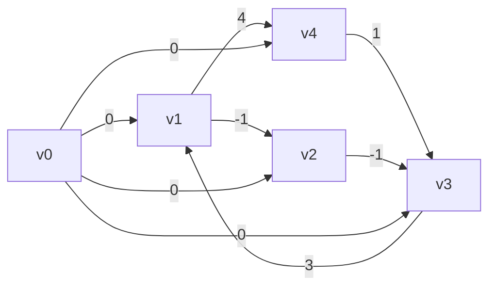

**Pseudocode**:
```c
function Bellman-Ford(G,w,s)  
	Init-Single-Source(G,s)  
	for each i = 1, ..., |V | − 1 do  
		for each (u, v) ∈ E do  
			Relax(u,v,w) // Relaxing all edges |V | − 1 times  
	for each (u, v) ∈ E do  
		if d[v] > d[u] + w(u, v) then  
			Return False // Negative cycle  
	Return True
```
#### Bellman-Ford Key Take-Aways
- Assume $G$ contains no negative cycles  
- **Running time**: $O(V E)$  
- **Path-relaxation property**: if $p = ⟨v_0, v_1, . . . , v_k⟩$ is shortest path from $s = v_0 →_p v_k$ and paths are relaxed in order $(v_0, v_1), (v_1, v_2), . . . , (v_{k−1}, v_k)$ then $d[vk] = δ(s, vk)$  
- Bellman-Ford is a dynamic programming algorithm, finding the shortest path of length $≤ i$ in each iteration.
#### Application
- **Difference Constraints**:

$$x_1 - x_3 \le 3$$
$$x_2 - x_2 \le -1$$
$$x_3 - x_2 \le -1$$
$$x_3 - x_4 \le 1$$
$$x_4 - x_1 \le 4$$

- Run Bellman Ford on this graph to get the solution to the system of difference constraints