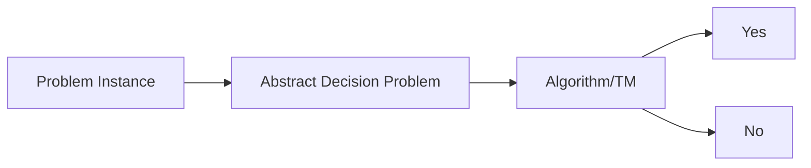
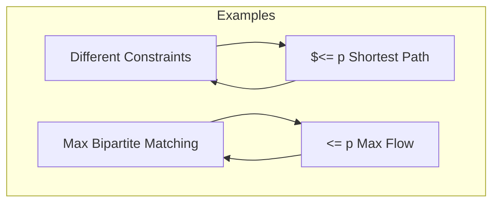
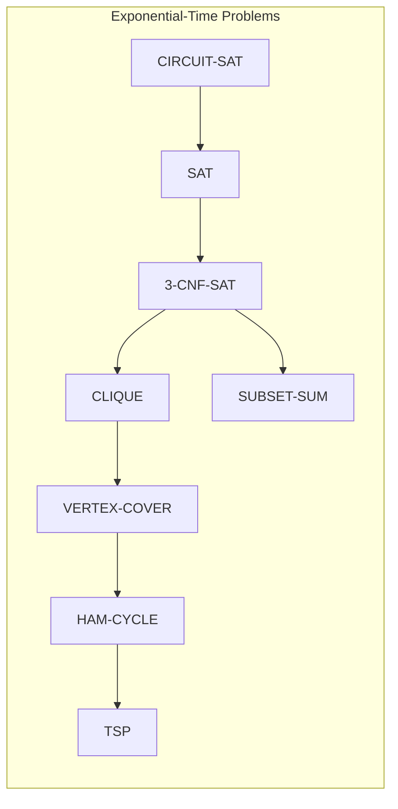

### Languages
##### Basic Notation
**Alphabet** $\sum$: A finite, nonempty set of symbols
- An alphabet particularly pertinent to the theory of computation is *binary alphabet {0,1}*

**String over alphabet**: A finite sequence of symbols from a given alphabet

$\sum^*$: The set of all strings over an alphabet $\sum$

$\sum^+$: $\sum^* -$ {$\in$}

**Binary Alphabet**: An alphabet of cardinality 2
**Binary Strings**: Strings over a binary alphabet
##### **Language** 
if $\sum$ is an alphabet and $L$ is a (possibly infinite) subset of $\sum^*$ then $L$ is said to be a *language* over $\sum$. Each element of $L$ is said to be a *string* of the language
###### Operations of Languages
- Union
- Intersection
- Difference
- Kleene star: $L^*$ = {$w \in \sum^* : w = w_{1} ... w_{k}$ for some $k \ge 0$ and some $w_{1},...,w_{k} \in L$}
	- "concatenating 0 or more strings from L"

$L =$ {$w \in \sum^* : w$ has property $P$}
- For a property P of strings to be admissible as a specification of a language, there must be *an algorithm for deciding whether a given string belongs to the language*
- An *algorithm* that is specifically designed for some language L, to answer the questions of the form "Is string w a member of L" will be called a **language recognition device**
___
##### Motivation
- Almost all algorithms we have studied thus far have been **polynomial-time algorithms**: Worst case $O(n^k)$
	- Generally, we think of these problems as being tractable, easy
	- Problems that require superpolynomial time as intractable or hard
- Some problems cannot be solved in $O(n^k)$
- Theory of ==NP-completeness restricts attention to decision problems==

==**Decision Problem**==: simply a problem for which the answer is yes or no (True or False). A *decision procedure* answers a decision problem

#### Decision Problem vs. Optimization Problem
- Many problems of interest are *optimization problems* in which feasible solutions have an associated value
- NP-completeness applies directly to decision problems not to optimization problems
	- We can cast a given optimization problem as a related decision problem by imposing a bound on the value to be optimized
	- Ex. A decision problem related to *shortest path* is *path* : given a directed graph G, vertices u and v and an integer k does a path exist from u to v consisting of at most k edges?
- If we can provide evidence that a decision problem is hard we also can provide evidence that its related optimization problem is hard (verifying is easier than finding solution)
- Thus, even though it restricts attention to decision problems the theory of NP-completeness often has implications for optimization problems as well

- We can view an abstract decision problem as a function that maps the instance set I to the solution set {0,1}

### Complexity
==**Class P**==: consists of those problems that are *solvable in polynomial time*.
- More specifically they are problems that can be solved in time $O(n^k)$ for some constant k, where n is the size of the input to the problem 
- The set of concrete decision problems that are polynomial-time solvable

==**Class NP**==: consists of problems that are =="verifiable"== in polynomial time. If we were somehow given a =="certificate"== of a solution then we could verify that the certificate is correct in time polynomials in the size of the input to the problem

==**Class NP-Complete**==: if problem is in NP and is as "hard" as any problem in NP

##### Polynomial-Time Verification
- Algorithms that verify membership in languages
- For a given instance i = <G, u, v, k> of the decision problem PATH, we are also given a path p from u to v. We can easily check whether p is a path in G and whether the length of p is at most k
- If so, we can view p as a "certificate" that the instance indeed belongs to PATH

- For a no polynomial-time decision algorithm, given a certificate, verification is easy
	- Ex. Hamiltonian cycles (HAM-CYCLE)
	- Formally a Ham-Cycle of an undirected graph G=<V,E> is a simple cycle that contains each vertex in V
	- Ham Cycle Problem: does a graph G have a ham cycle?
	- NP-Complete

**Verification Algorithms**: a 2 argument algorithm A where 1 argument is an ordinary input string x and the other is a binary string y called a *certificate*
- A 2 argument algorithm A *verifies* an input string x if there exists a certificate y such that A(x,y)=1
- The *language verified* by a verification algorithm A is
$L =$ {$x \in$ {0,1}$^*$ : there exists $y \in$ {0,1}$^*$ such that $A(x,y) = 1$}
HAM-CYCLE = {$<G> : G$ is a hamiltonian graph}

### The Complexity Class NP 
- A language L belongs to NP is and only if there exists a 2 input polynomial time algorithm A and a constant c such that
	$L =$ {$x \in$ {0,1}$^*$ : there exists a certificate $y$ with $|y| = O(|x|^c)$ such that $A(x,y) = 1$}
- We say that algorithm A verifies language L in polynomial time

- If $L \in P$, then $L \in NP$ -> $P \subseteq NP$

### The Complexity Class Co-NP
- A set of languages L such that $\overline{L} \in NP$
### ==Reducibility==
- A language $L_{1}$ is *polynomial-time reducible* to a language $L_{2}$ written $L_{1} \le_{p} L_{2}$, if there exists a polynomial-time computable function $f :$ {0,1}$^*$ -> {0,1}$^*$ such that for all $x \in$ {0,1}$^*$, $x \in L_{1}$ if and only if $f(x) \in L_{2}$
- Polynomial-time reductions provide a formal means for showing that 1 problem is *at least as hard as another* to within a polynomial-time factor

- ==<= p ==: one is at least as hard as another (Written as $\le_{p}$ elsewhere but graph language doesn't do LaTeX)

==**Lemma 34.3**==
If $L_{1}, L_{2} \subseteq$ {0,1}$^*$ are languages such that $L_{1} \le_{p} L_{2}$, then $L_{2} \in P$ implies $L_{1} \in P$
### NP-Completeness
- The hardest problems in NP
==**NP-Completeness**==: A language $L \subseteq$ {0,1}$^*$ is *NP-Complete* if
1. $L \in NP$, and
2. $L' \le_{p} L$ for every $L' \in NP$ ==(NP-Hard)==

### NP-Hard
- If a language $L$ satisfies property 2 but not necessarily property 1

- Once we prove at least 1 problem is NP-Complete, we can use polynomial-time reducibility as a tool to prove other problems to be NP-Complete
	- ==Basically describe a problem using another problem *we know is NPC* to say that problem is also NPC==
### Prove a Language L is NP-Complete:
1. Prove $L \in NP$
2. Select a known NP-complete language L'
3. Describe an algorithm that computes a function $f$ mapping every instance $x \in$ {0,1}* of L' to an instance $f(x)$ of L
4. Prove that the function $f$ satisfies $x \in L'$ if and only if $f(x) \in L$ for all $x \in$ {0,1}*
5. Prove that the algorithm computing $f$ runs in polynomial time

#### Circuit-Satisfiability Problem (CIRCUIT-SAT)
- Given a boolean circuit, is there some input that will eventually output 1?
- The size of a boolean combinatorial circuit is the number of boolean combination elements plus the number of wires in the circuit
- If the circuit has k inputs then we would have to check up to $2^k$ possible assignments
- When the size of C is polynomial in k, checking each one takes $\Omega(2^k)$ time which is superpolynomial in the size of the circuit
#### Satisfiability Formula (SAT)
- An instance of SAT is a boolean formula $\phi$  composed of
	1. n boolean variables: $x_{1}, x_{2}, ...  , x_{n}$
	2. m boolean connectives: any boolean with the 1 or 2 inputs and 1 output such as $\land$ (AND), $\lor$ (OR), $\neg$  (NOT), $\rightarrow$ (implies that), $\leftrightarrow$ (if and only if) and
	3. parentheses (without loss of generality, we assume that there are no redundant parentheses i.e., a formula contains at most 1 pair of parentheses per boolean connective)
##### Prove SAT is NP-Complete
1. SAT $\in$ NP
	- Given a boolean assignment ($x_{1}, x_{2},...,x_{n}$) the verifying algorithm can simply replace each variable in the formula with its value and then evaluate the expression. This task is poly-time.

2. SAT $\in$ NP-Hard
	- CIRCUIT-SAT <=p SAT
	- Given a boolean circuit we will construct a formula $\Phi$ such that circuit is satisfiable if and only if $\Phi$ is satisfiable
		- AND of the circuit-output variable with the conjunction of clauses describing the operation of each gate
	- ==Need to prove both directions:
		1. If the circuit is satisfiable then each wire in the circuit C has a well-defined value to variables in $\Phi$ to make each clause in $\Phi = 1$ so $\Phi = 1$
		2. Reverse proof can be done the same way
		3. $\lor$ gate we introduce a constant number of literals (variables & connectives). Therefore, the construction takes poly-time
		4. Q.E.D
	- Wrong Approach: SAT $\le$ p CIRCUIT-SAT, opposite direction erroneous!
#### Clique Problem
**Clique**: in an undirected graph $G = (V,E)$ a clique is a subset of the vertices $V' \subseteq V$ such that each pair of vertices in V' is connected by an edge $\in E$ 

**Clique Problem**: optimization problem for finding max size clique

**Application**: social network, chemistry networks, computational biology

**Decision Problem**: Does G have a clique of size K
- Naïve Algorithm: brute force $\Omega(k^2{|v| \choose k})$ 
##### Prove Clique Problem is NP-Complete
1. CLIQUE $\in$ NP
	- To show that CLIQUE $\in$ NP for a given graph $G = (V,E)$, we use the set $V' \subseteq V$ of vertices in the clique as a certificate for G. We can check whether V' is a clique in polynomial time by checking whether for each pair u, $v \in V'$, the edge (u,v) belongs to E
2. CLIQUE $\in$ NP-Hard
	- 3-CNF-SAT $\le$ p CLIQUE
		- 2 rules for this to work: do not connect variables of the same clause and do not connect a variable to its negation
	- Proof: show that this transformation of $\phi$ into G is a reduction
		- Suppose that $\phi$ is satisfiable, then a satisfying assignment means each clause has at least 1 literal thus picking 1 true literal from each clause, with non-contradictory assignment yields a set of v' of k vertices => v' is a clique
		- Suppose G has a clique V of size k. No edge from the same triple => V' has 1 vertex per tiple => 1 vertex per clause, none-contradiction, yields a consistent assignment satisfying all clauses
		- Alternative: show there isn't a satisfying assignment for the formula then the maximum clique size is < m
#### Vertex Cover Problem
**Vertex Cover**: A vertex cover of an undirected graph G = (V,E) is a subset $V' \subseteq V$ such that if (u, v) $\in$ E then u $\in$ V' or v $\in$ V' or both
- That is each vertex "covers" its incident edges and a vertex cover for G is a set of vertices that covers all edges in E
- The size of a vertex cover is the number of vertices in it

**Vertex Cover Problem**: is to find a vertex cover of minimum size in a given graph

**Decision Problem**: determine whether a graph has a vertex cover of a given size k

##### Prove Vertex Cover Problem is NP-Complete
1. VERTEX-COVER $\in$ NP
	- Certificate: subset $V' \subseteq V$
	- Verification algorithm:
		- |V'| = k
		- For each edge (u,v) $\in$ E that u $\in$ V' or v $\in$ V'
2. Clique $\le_{p}$ VERTEX-COVER
	- Intuition: This reduction relies on the notion of the "complement" of a graph 
	- Given an undirected graph G=(V,E), we define the complement as  $\overline{G}=(V,\overline{E})$ where $\overline{E} =$ {(u,v) : u, v $\in$ V, u $\ne$ v and (u,v) $\notin$ E}
	- $\overline{G}$ is the graph containing exactly those edges that are not in G
#### Traveling Sales Man Problem
- Closely linked to the HAM-CYCLE problem
- Salesman must visit n cities
- Modelling the problem as a complete graph with n vertices 
	- Salesman makes a ham-cycle visiting each city exactly once and finishing at the city he starts from
- Salesman incurs a nonnegative integer cost c(i,j) to travel from city i to city j and the salesman wishes to make the tour whose total cost is minimum where total cost is the sum of the individual costs along the edges of the tour
##### Prove the Traveling Salesman Problem is NP-Complete
1. TSP $\in$ NP
	- Certificate: Set of edges/Sequence of vertices
	- Verification Algorithm:
		1. Check the cost $\le$ k
		2. check if we visit all the vertices exactly once -> poly-time
2. TSP $\in$ NP-Hard
	- HAM-CYCLE $\le_{p}$ TSP
		1. Let a graph G=(V,E) we try to find a HAM-CYCLE on G
		2. Complete G to a complete graph G'
		3. Assign cost to each edge