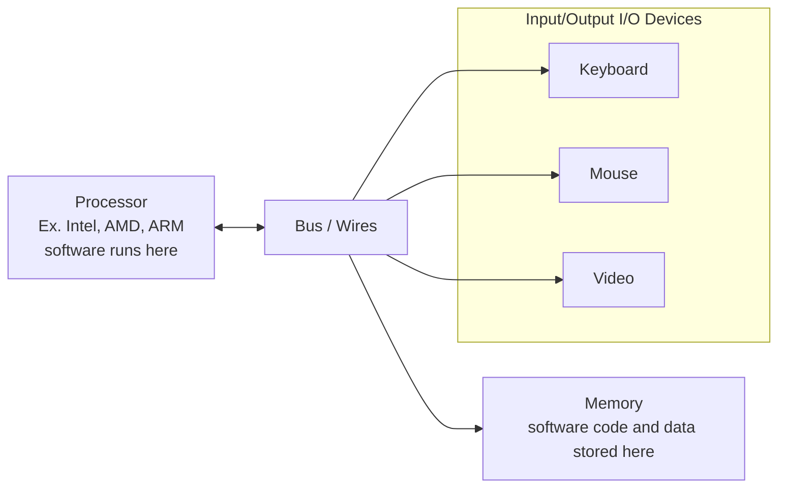

### 1. Representing Information
- In computer hardware circuits (i.e. logic circuits) all information is represented using only 2 symbols:
	- 0 (electrical ground)
	- 1 (power supply)
- All information is encoded using combinations of 0s and 1s
- Numbers: we use binary (base 2), because digits only have 2 values
	- composed of powers of 2
**Bit**: a binary digit
- Group of 8 bits is a byte
- Group of 4 bits is a nibble
**Hexadecimal**: base 16
- Hex is a useful short form of binary because each hex digit is a nibble ($16=2^4$)
- Bit significance: for n-bit number, $2^n$ most significant bit (MSB), $2^0$ least significant bit (LSB)
	- In 2's complement $2^n$ is the sign bit
### 2. Addition
- Bitwise: $1000+0101= 1101$
- Hexadecimal: 5A2+37B=91D
### 3. Subtraction
- Subtraction is too awkward so we do addition of the negative (add the 2s complement)
#### 3.1 2s Complement
$$
-k = \overline{k} + 1
$$

- Shortcut: Start from right, keep all bits up to and including the first 1, complement the rest
- Ex.
	- 0011 1010 0110
	- 1100 0101 1010