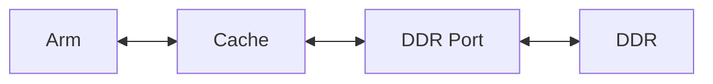
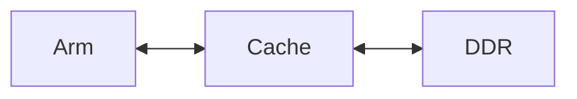

### 1. Memory Technology
- There are 1 main categories:
	1. Static
	2. Dynamic
#### 1.1 Static Random Access Memory (SRAM)
- e.g. On-chip Memory in FPGA
- Summary: The address activates a word line using the decoder. This row is connected to the bit lines
- Chips have to be approximately a square
#### 1.2 Dynamic Memory
- Since the storage cell is very small then much larger capacity memories can be made
- The capacitor holds a charge when the cell is written with "1" the charge will not remain forever
	- Every cell must be "refreshed" periodically
- Example: The DE1-SOC board has 1GB of DDR3 (Double Date Rate Ver. 3) Synchronous Dynamic Random Access Memory (DRAM)
### 2. DDR Memory
- Q: How many address inputs needed for each chip?
	- There are 256m words $2^8*2^{20}=2^{28} \therefore$ we need 28 address lines to select words
	- But there are only 15 address inputs
		- The row address and column address are input separately using $A_{14-0}$ (Also $BA_{2-0}$ are address inputs)
		- The 15 address input implies $2^{15} = 32k$ rows
- Q: How many columns are in a Bank
	- 256M * 16 = 4Gbits storage cells
	- 4Gb / 32k rows = 128 kb/row
	- 128kb / 16 bits/column = 8k columns/row
	- Therefore, 8k columns / 8 banks = 1k columns/bank
	- Address Lines 15(32k rows) + 10(1k col/bank) + 3(bank) = 28

- Refresh: Every storage cell has to be automatically read/written at regular periods to avoid the memory cells (capacitors) from losing their charge. Refresh is done by the chip itself in each bank (the banks can be refreshed in parallel)
#### 2.1 DDR Controller
- A DDR controller is required between ARM and the DDR Memory
	- Given a 28 bit address $A_{27-0}$ from ARM, the DDR Port:
		1. Activate a Bank using $BA_{2-0}$
		2. Apply a row address on DDR $A_{14-0}$, then pulse $\overline{RAS}$ input (row address strobe)
		3. Apply column address on DDR $A_{9-0}$, and pulse $\overline{CAS}$ input (column address strobe)
		4. For read, the DDR memory provides 16 bit word at the address to the DDR port which then sends it to ARM
		5. For write ...
### 3. Direct-Mapped Caches
- Can take many clock cycles to read a word (>100)
	- But successive words (which would be adjacent columns) can be provided quickly
- Q: Why is this useful?
	- To fill a cache line

**Cache Memory**: A cache is a small, fast memory (SRAM) that is situated between the processor and main memory (DDR)

- ARM does not need to know about the cache, it just reads (writes) memory using addresses in the normal way
- Example: ARM fetches (reads) and instruction at address A:
	- The cache controller reads a block of successive words from the memory, including the word (instruction) at address A.
		- It stores the words in the cache's memory
		- It returns the requested word to ARM
	- The ARM processor now fetches the instruction at address A+1
		- The cache provides the corresponding instruction immediately
		- This is called a cache hit
		- When the requested word is not already in the cache, this is a miss
- This is useful because:
	1. Cache is fast (1-2 clock cycles, as opposed to >100 for DDR)
	2. Programs exhibit locality
		- Adjacent instruction words are used repeatedly
			- Adjacent - spatial locality
			- Repeatedly - temporal locality
- A cache is organized into rows and columns. Each row is a cache line (aka block), and each column stores a word (instruction)
- Summary: ARM reads from address, it is readying from the cache controller
	- It examines 3 parts of the address (max 30 bits): T, L and W
	- The controller first looks at the L bits and then compares the T bits in the address with the store tag bits in line L
		- If they match (and V=1) then it is a hit
	- The controller returns word w from its line L to ARM
	- If a miss: read block of words from DDR to fill line L in the cache and set V=1
	- If we are caching data (as opposed to instructions), then ARM could perform a write.
		- On a hit:
			1. The controller could just write to only the cache line and set D=1 for that line. Eventually this dirty line will get replaced in the cache ('ejected') due to a conflict with another block. Then it gets written back to DDR. This is called a write back policy
			2. The controller immediately writes to both the line and DDR. This is a write through policy
		- On a miss:
			1. Controller writes only to DDR
			2. Controller first "fills" the cache line by reading a block from DDR and then writes to the cache line. This is a write allocate policy
### 4. Associative Cache
- This is the "opposite extreme" of a direct-mapped cache for associative each memory block can be stored in any cache line

**Contact Addressable Memory (CAM)**: You can provide data to the CAM instead of an address. The CAM compares the data to the stored tag in all rows at the same time where V = 1. If there is a match then it is a hit and the corresponding cache line will be output to the word mux.

**Comparator**: Each bit in the stored tag is compared to the data.
- We need a comparator for every line in this type of cache, this is expensive so there is a trade off: Set associative cache
#### 4.1 Set Associative Cache
- Each block from memory can map to a specific set of cache lines based on the address
- Example: Your ARM processor has an instruction case, with 1K lines, 8 words per line, organized into 256 sets (of 4 lines/set)

- Q: Once we use the 5 bits to select a set, how is one of the 4 cache lines in the set selected
	- A: If some cache line isn't being used (V = 0), then choose that line, but if all lines are in use, then the cache must "eject" a line and replace it with the new block from memory (then update the stored tag). Which one should be replaces?
		- Replace the "oldest line" (the one that has been there the longest)
		- Replace the "least recently used" (LRU) line
		- Choose a line randomly (works well in practice)
### 5. Performance With/Without Caches

- The performance of code running on the processor depends strongly on the cache hit ratio
- Assume: to read from cache takes C cycles and to read from DDR takes m cycles
	- where C = 4 and m = 300
	- Hit ratio = h = # memory access hits / # total memory accesses
	- Miss ratio: 1 - h
	- Average # cycles to access memory (AAC): AAC = h x c + (1 - h) x m