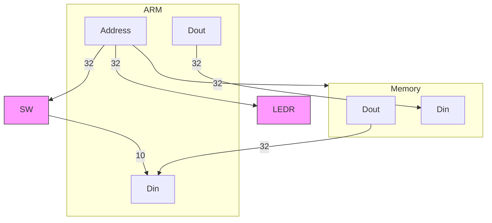

### 1. Using the ARM Processor
- ARM is a ubiquitous processor - all phones, medical equipment, vehicles, etc, all have ARM processors
- Stands for Advanced RISC Machine
	- RISC stands for Reduced Instruction Set Computer
- DE1-SOC, SOC has ARM and FPGA
	- We program a circuit into the FPGA to implement the DE1-SOC computer (Arm Cortex A9)
- Your programs will run on ARM and are stored in main memory (1GB) ([DDR 3](14.%20Memory%20Systems.md) chips)
- There are various I/O devices (ports) such as switches (SW), LED (LEDR) lights
### 2. ARM Processor to Memory & I/O Devices Connections (Bus Wires)

- $2^{30}$ = 1G

| Devices | Address Range    |
| ------- | ---------------- |
| Memory  | 0 to 0x3FFF FFFF |
| LEDR    | 0xFF20 0000      |
| SW      | 0xFF20 0040      |
