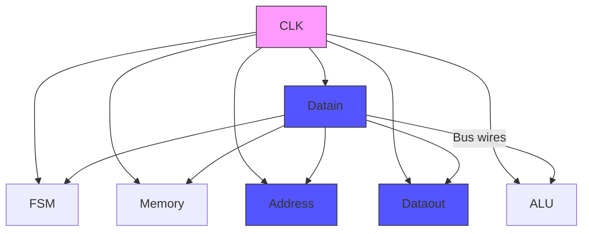

### 1. Introduction
- ARM has a 32-bit memory interface for both address and data

| Word Address | 31 ... 0 | Byte Address     |
| ------------ | -------- | ---------------- |
| 0            |          | 3 \| 2 \| 1 \| 0 |
| 4            |          |                  |
| 8            |          |                  |
| 12           |          |                  |
- Each row of the memory stores a 32-bit word of data
	- Each of the 4 bytes has its own address (ARM is byte addressable)
- Byte on the right has the same address as the word (0)
	- This is called **Little Endian**
### 2. ARM Processor Architecture
- A processor is a logic circuit
	- It contains a set of general purpose **registers** that a programmer uses for code, an **Arithmetic & Logic Unit (ALU)** that can add, subtract, multiply and, or, shifting, etc
	- There is an **internal bus** (wires) that interconnects everything, **control circuit (FSM)** and an **external interface** to memory

- The FSM controls all the components on every clock cycle so that data can be transferred as needed over the bus wires
- The processor needs to be able to read/write memory (& I/O), add, sub, control program flow
	- The processor has Assembly language instructions for each task
#### 2.1 Assembly Examples
- **Read from Memory**:
```arm-asm
// R0 <- contents of memory at address R3:
LDR R0, [R3]
```
- **Write to Memory**:
```arm-asm
// Store R0 into memory at address R4:
STR R0, [R4]
```
- **Initialize Registers**:
```arm-asm
// Initialize R0 <- 0 (#0 is called immediate data):
mov R0, #0
// Copy R2 to R1
mov R1, R2
// (movT means move top half)
// Put immediate Data (0xFF20) in bits R0 31-16
movT R0, #0xF20
// R5 <- R5 + R6
ADD R5, R6
```
- Example ARM Program:
```arm-asm
// Load SW and store to LEDR in a loop
.global -start

-start: mov    R1, #0          // R1 gets 0
		movT   R1, #0xFF20     // R1 gets 0xFF20 0000 (LEDR)
LOOP:   LDR    R0 [R1, #0x40]  // Load R0 from address 0xFF20 0040
		STR    R0, [R1]        // Store R0 to R1 (0xFF20 0000)
		B      LOOP
```
- We assemble (compile) this code into machine code which gets stored into memory then executed by ARM