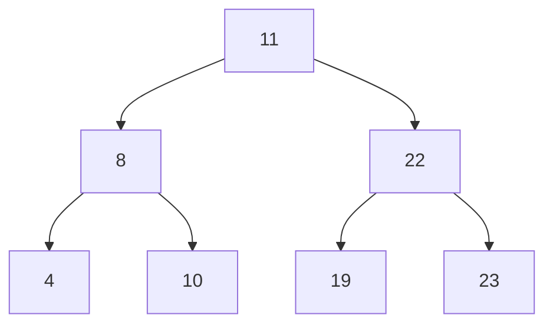

## 1. Definition
**BST properties**:  
- If $y$ is in the left subtree of $x$, then $key[y] ≤ key[x]$  
- If $y$ is in the right subtree of $x$, then $key[y] ≥ key[x]$  

**Key Take-Aways**:
- In general, if a BST has n nodes, $h = O(n)$. Only if the BST is balanced, $h = O(log n)$  
- Minimum/Maximum and searching for any arbitrary key $O(h)$  
- Successor/Predecessor $O(h)$  
- Insertion/Deletion $O(h)$  
- Build-BST: $O(n^2)$ worst case (chain)  

**In-Order Traversal**: Visits nodes from least to greatest

**Pre-Order Traversal**: From root to left then right

**Post Order**: Start from ends (left side) then right side all the way to root

**Example**:


## 2. Implementation
**Struct**:
```c
typedef struct node {
	int data;
	struct node *left, *right;
} Node;
```
```c
typedef struct bstree {
	Node* root;
} BSTree;
```

**Create Node**:
```c
Node* createNode(int data) {
	Node* p = (Node*)malloc(sizeof(Node*));
	
	if (p != NULL) {
		p->data = data;
		p->left = NULL;
		p->right = NULL;
	}
	
	return p;
}
```

**Initialize Tree**:
```c
void initBSTree (BSTree* tree) {
	tree->root = NULL;
}
```

**Check if Empty**:
```c
bool isEmpty(BSTree* tree) {
	return tree->root == NULL
}
```

**Print**:
```c
void printHelper(Node* n) { // Print recursively
	if (n != NULL) {
		print(n->left);
		printf("%d", n->data);
		print(n->right);
	}
}

void print(BSTree* tree) {
	return print(tree->root);
}
```

**Search**:
```c
Node* search(BSTree* tree, int data) {
	Node* current = tree->root;
	
	while (current != NULL && current->data != data) {
		if (data < current->data) {
			current = current->left;
		} else {
			current = current->right;
		}
	}
	
	return current;
}
```

**Insertion**:
```c
bool insert(BSTree* tree, int data) {
	Node* current = tree->root;
	Node* parent = NULL;
	
	if (isEmpty(tree)) {
		tree->root = createNode(data);
		return tree->root != NULL;
	}
	
	while (current != NULL) {
		parent = current;
		
		if (data < current->data) {
			current = current->left;
		} else {
			current = current->right;
		}
	}
	
	if (data < parent->data) {
		parent->left = createNode(data);
		return parent->left != NULL;
	} else {
		parent->right = createNode(data);
		return parent->right != NULL;
	}
}
```