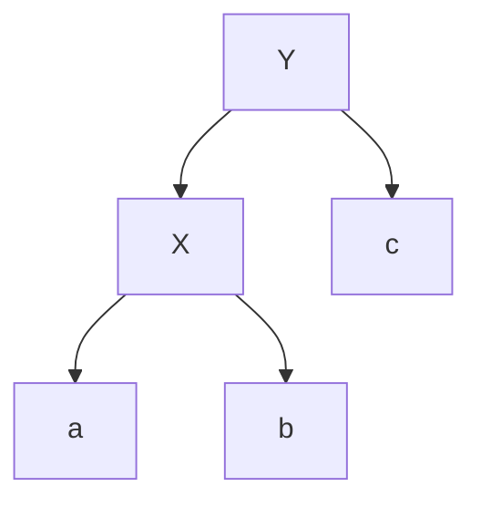

## Red Black Tree
**Red Black Tree** is a Binary Search Tree with the following additional properties:
- Every node is either red or black
- The root is black
- All leaves (NIL) are black
- If a node is red, both its children are black
- For all nodes, all paths to all leaves have the same black-height (number of black nodes on path to a leaf, not including itself, but including NIL)

**Key Take-Aways**
- RB Trees are balanced $h = O(logn)$
- All read-only operations (e.g. traversals are all the same as BST)
- Rotation


^ Left-Rotate(T, x)
v Right-Rotate(T, y)
___
## Minimum Spanning Tree
**Spanning Tree**: $T ⊆ E$ such that $∀v ∈ V$, $∃(u, v) ∈ T or ∃(v, u) ∈ T$. (contains all vertices)

**Minimum Spanning Tree**: Spanning tree $T ⊆ E$ such that $w(T ) = \sum_{(u,v) \in T} w(u, v)$ is minimized.

**Prim's Algorithm**: $O(E log V )$ with binary heap (and $O(V log V + E)$ with Fibonacci heap)

- An MST always has $|V |$ vertices and $|V | − 1$ edges ($|E_{MST}| = |V_{MST}| − 1$)  
- Consider $(u, v) ∈ T$ and $(x, y) /∈ T$, then $T ∪ {(x, y)}$ always contains a cycle and $T$ \ ${(u, v)} ∪ {(x, y)}$ is a spanning tree

**Pseudocode**:
```c
function Prims(V, E, r)
	Insert every vertex in Queue(Q) // Make Queue using minheap
	Decrease_Queue(Q,r,0) // log|V|
	while Q != 0
		V = Extract_Min(Q)
		For all V adjacent to V by edge (u,v)
		if w(u,v) < key(v)
			Decrease_Queue(Q,V,W(u,v))
```