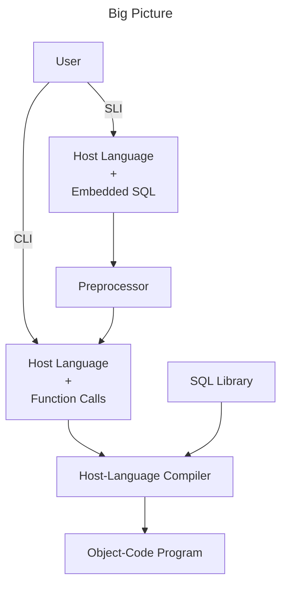

## 11.1 Problems with using Interactive SQL
- Standard SQL is not "Turing-complete"
	- E.g., Two profs are "colleagues" if they've co-taught a course or share colleague
	- We can't write a query to find all colleagues of a given professor because we have no loops or recursion
- You can't control the format of its output
- And most users shouldn't be writing SQL queries!
	- You want to run queries that are *based on* user input, not have users writing actual queries

## 11.2 SQL + a Conventional Language
- If we can combine SQL with code in a conventional language, we can solve these problems
- But we have another problem:
	- A SQL query yields a table and conventional languages have no such type
- it is solves by
	- Feeding tuples from SQL to the other language one at a time and
	- Feeding each attribute value into a particular variable

## 11.3 Approaches
- Three approaches for combining SQL and a general-purpose language:
	1. Stored Procedures
	2. Statement-Level Interface
	3. Call-Level Interface

### 11.3.1 Stored Procedures
- The SQL standard includes a language for defining "stored procedures" which can
	- Have parameters and a return value
	- Use local variables, ifs, loops, etc
	- Execute SQL queries

**Example Stored Procedure**
- A boolean function `QuietYear(y INT, s CHAR(15))` that returns true if and only if
	- Movie studio s produces no movies in year y or
	- Produced at most 10 comedies
```sql
CREATE FUNCTION QuietYear(y INT, s CHAR(15)) RETURNS BOOLEAN
IF NOT EXISTS
	(SELECT *
	FROM Movies
	WHERE year = y AND studioName = s)
THEN RETURN TRUE;
ELSIF 10 <=
	(SELECT COUNT(*)
	FROM Movies
	WHERE year = y AND studioName = s AND
	genre = ‘comedy’)
THEN RETURN TRUE;
ELSE RETURN FALSE;
END IF;
```

**Using a Stored Procedure**
- Once defined, a stored procedure can be used in these ways:
	- Called from the interpreter
	- Called from SQL queries
	- Called from another stored procedure,
	- Be the action that a trigger performs

**Calling the Stored Procedure in a Query**
```sql
SELECT StudioName 
FROM Studios 
WHERE QuietYear(2010, StudioName);
```

**Not Very Standard**
- The language is called SQL/PSM (Persistent Stored Modules)
	- It came into the SQL standard in SQL3, 1999
- By then commercial DBMSs had defined their own proprietary languages for stored procedures
	- They have generally stuck to them
- PostgreSQL has defined PL/pgSQL
	- It supports some, but not all of the standard

### 11.3.2 Statement-Level Interface (SLI)
- Embed SQL statements into code in a conventional language like C or Java
- Use a preprocessor to replace the SQL with calls written in the host language to functions defined in an SQL library
- Special syntax indicates which bits of code the preprocessor needs to convert
- Example:
```sql
void printNetWorth() {
	EXEC SQL BEGIN DECLARE SECTION;
		char studioName[50];
		int presNetWorth;
		char SQLSTATE[6]; // Status of most recent SQL stmt
	EXEC SQL END DECLARE SECTION;
	/* OMITTED: Get value for studioName from the user. */
	EXEC SQL SELECT netWorth
		INTO :presNetWorth
		FROM Studio, MovieExec
		WHERE Studio.name = :studioName;
	/* OMITTED: Report back to the user */
```



### 11.3.3 Call-Level Interface (CLI)
- Instead of using a pre-processor to replace embedded SQL with calls to library functions, write those calls yourself
- Eliminates need to preprocess
- Each language has its own library for this. Examples:
	- C has SQL/CLI
	- Java has JDBC
- We'll look at psycopg2 for Python
	- Can connect a Python program to PostgreSQL, MySQL, SQLite, etc. We'll use it with PostgreSQL of course

**Aside: Where to run psycopg2 code**
- Our database server (dbsrv1) is configured so that you can only connect to it from that machine
- So you must run your psycopg2 code on dbsrv1
- This configuration is for security

**If this query isn't known in advance**
- What if the query depends on something, e.g.,
	- The result of a computation
	- Input from somewhere
- Then we can't write the full query in quotes

## 11.4 SQL Injections
- We just saw an example of an injection
- The simple approach of building up a query string and passing it to execute is vulnerable to injections
- Moral of the story: Don't do that!
- Instead, use the second argument of the execute method to complete a query dynamically at run time
