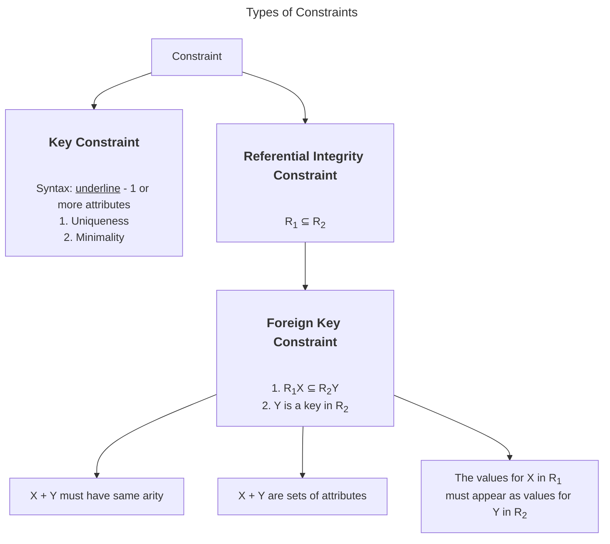

- The relational model is based on the concepts of a relation or table

## 2.1 Relations in Math
- A domain is a set of values
- Suppose $D_{1}, D_{2}, ... D_n$ are domains
	- The *Cartesian product* $D_{1}\times D_{2}\times ...\times D_n$ is the set of all tuples $<d_{1}, d_{2}, ..., d_n>$ such that $d_{1}\in D_{1}, d_{2}\in D_{2}, ..., d_{n}\in D_n$ 
	- i.e., every combination of a value from $D_1$, a value from $D_2$ etc.
- A *(mathematical) relation* on $D_{1}, D_{2}, ..., D_n$ is a subset of the Cartesian product

___
### 2.1.1 Examples
1. **3 Example Relations on** $D_{1}, D_{2}$ **and** $D_3$ 
$D_1 = \{p, q, r, s\}, D_2 = \{1, 2, 3\}$ and $D_3 = \{100, 200\}.$ 
$\{\}$
$\{ <p,1,100>, <p,1,200>, <p,2,100>, <p,2,200>,$
  $<p,3,100>, <p,3,200>,$
  $<q,1,100>, <q,1,200>, <q,2,100>, <q,2,200>,$
  $<q,3,100>, <q,3,200>,$
  $<r,1,100>, <r,1,200>, <r,2,100>, <r,2,200>,$
  $<r,3,100>, <r,3,200>,$
  $<s,1,100>, <s,1,200>, <s,2,100>, <s,2,200>,$
  $<s,3,100>, <s,3,200> \}$
  $\{ <q,2,100>,<s,3,200>,<p,1,200>\}$

2. Suppose $D_1 = \{p, q, r, s\}, D_2 = \{1, 2, 3\}$ and $D_3 = \{100, 200\}.$ What is the greatest possible number of tuples in a relation on $D_{1}, D_{2},$ and $D_3$? Ans: 24 (4\*3\*2)
___

- A database table is a relation
- Here is a table:

| Home Team | Away Team | Home Goals | Away Goals |
| ---- | ---- | ---- | ---- |
| Rangers | Ducks | 3 | 0 |
| Ducks | Choppers | 1 | 1 |
| Rangers | Choppers | 4 | 2 |
| Choppers | Ducks | 0 | 5 |

- Here it is as a relation:
	$\{ <Rangers, Ducks, 3, 0>, <Ducks, Choppers,1,1>,$
	$<Rangers, Choppers, 4,2>, <Choppers, Ducks, 0, 5> \}$ 

## 2.2 Relation Schemas versus Instances

**Schema**: The structure of a relation
- Ex. informal description: Teams have 3 attributes: name, home field, coach. No 2 teams can have the same name
- Ex. formal notation: *Teams(Name, HomeField, Coach)*

**Instance**: The content of a relation
- Notation: We usually write it down in a table. Ex. actual data

| Name | Home Field | Coach |
| ---- | ---- | ---- |
| Rangers | Runnymede Cl | Tarvo Sinervo |
| Ducks | Humber Public | Tracy Zheng |
| Choppers | High Park | Ammar Jalali |
| Crullers | WTCS | Anna Liu |
## 2.3 Change in a Database
- Instances change constantly
- Schemas (should) change rarely
- Databases usually store the current version of the data
- Databases that record the history are called *temporal* databases

## 2.4 Terminology
**Relation**: Table
**Attribute**: Column
**Tuple**: Row
**Arity**: (of a relation) number of attributes (3 in above table)
**Cardinality**: (of a relation) number of tuples (4 in above table)

- A **relation** is a *set* of tuples which means:
	- There can be no duplicate tuples
	- Order of the tuples doesn't matter
- In another model, relations are bags (multisets) - a generalization of sets that allows duplicates
	- Commercial DBMSs use this model
- But for now, we will stick with relations as sets

**Database Schema**: A set of relation schemas

**Database Instance**: A set of relation instances
___
### 2.4.1 A Schema for our League Data
```
Teams(name, homefield, coach) 
Games(hometeam, awayteam, homegoals, awaygoals)
```

- Can there be $\gt 1$ team with the same name?
	- Didn't happen in our dataset, but could it?
	- That's up to the league, not us!
- Suppose the league wants to allow:
	- Multiple teams with the same name
	- Multiple teams with same home field
- The schema allows it: nothing says otherwise
- But what if the league wants to disallow:
	- Multiple teams with the same name *and* home field?
___
## 2.5 Keys
**Keys**: A key for a relation is a set of *attributes $a_{1}, a_{2}, ..., a_n$ such that:
1. **Uniqueness**: Their combined values must be unique (i.e., this is a known fact about the domain). Formally, $∄$ tuples $t_1$ and $t_2$ such that $(t_1.a_{1} = t_2.a_{1}) \land (t_1.a_{2}=t_2.a_{2)}\land ... \land (t_1.a_{n}=t_2.a_n)$ 
2. **Minimality**: No subset of $a_1,a_2,...,a_n$ has this property

- Declaring a key constrains the data
	- How to disallow multiple teams with the same name *and* home field?
		- Declare that name and homefield together are a key for the Teams relation
	- Notation for this: *underline* 
		- Ex. Teams(<u>name, homefield</u>, coach)
	- Meaning: ∄ tuples $t_1$ and $t_2$ such that
		- $(t_{1}.name=t_2.name)\land(t_1.homefield=t_2.homefield)$

- Why are they called "keys"?
	- A key will uniquely identify/unlock 1 tuple

**Superkey**: Any superset of a key.
- They are useful for database theory. In practice, we only declare keys not superkeys

___
### 2.5.1 Example
Course(dept, number, name, breadth) 
- E.g., <“csc”, “343”, “Introduction to Databases”, True> 
- Suppose we know from the domain experts that no two tuples can have the same value for dept and number.
	- Says that dept, number will be unique. Minimal?

1. Is {dept, number} a key for this relation?
	- Only if our domain expert can tell us its also minimal.
2. How would we declare that it is a key?
	-  Course(<u>dept, number</u>, name, breadth) 
3. Make an instance of Course that violates this constraint

| dept | number | name | breadth |
| ---- | ---- | ---- | ---- |
| CSC | 343 | Databases | True |
| CSC | 343 | ML | True |

4. Is {dept, number, name} a key?
	- No. Unique but not minimal.
5. Does every relation have a key? 
	- Yes, in the "worst case", all attributes form the key.
6. Can a relation have more than one key?
	- Yes. Ex. student number and UTorid
___

**Key**: A minimal set of attributes such that no 2 tuples can have the same values on all of these attributes.

**Superkey**: A superset of some key (not necessarily a proper subset)

**Coincidence vs Key**
- Is a set of attributes is a key for a relation:
	- It does not mean merely that there are no duplicates in a particular instance of the relation
	- It means that in principle there *cannot* be any
	- Only a domain expert can determine that
- Often we invent an attribute to ensure all tuples will be unique
	- This predates databases
	- Ex. SIN, ISBN number, VIN
- A key defines a kind of *integrity constraint*
___
## 2.5.2 Relational Model Worksheet Example
**Schema**:
Movies(<u>mID</u>, title, director, year, length)
Artists(<u>aID</u>, aName, nationality)

**Example Instances**:

1. **Movies**

| mID | title | director | year | length |
| ---- | ---- | ---- | ---- | ---- |
| 1 | Shining | Kubrick | 1980 | 146 |
| 2 | Player | Altman | 1992 | 146 |
| 3 | Chinatown | Polanski | 1974 | 131 |
| 4 | Repulsion | Polanski | 1965 | 143 |
| 5 | Star Wars IV | Lucas | 1977 | 126 |
| 6 | American Graffiti | Lucas | 1973 | 110 |
| 7 | Full Metal Jacket | Kubrick | 1987 | 156 |

2. **Artists**

| aID | aName | nat |
| ---- | ---- | ---- |
| 1 | Nicholson | American |
| 2 | Ford | American |
| 3 | Stone | British |
| 4 | Fisher | American |

4. What is the cardinality of relation Movies? Ans: 7
5. What is the arity of relation Artists? Ans: 3
6. What is the key of relation Movies? Ans: `mID`
7. Change the instance of relation Artists in a way that violates its key constraint.
	- Ans: Multiple answers, <1, Smith, Canadians>
8. According to the schema, is there any limit on the number of directors a movie can have? That is, can one `mID` be associated with two or more directors?  
	- Not easily, would have to change the domain
9. According to the schema, can exactly the same movie title be used for two different movies? Ans: Yes

- Now suppose we add a third relation, with two foreign constraints:
Roles(<u>mID, aID, character</u>)
Roles\[mID] $\subseteq$ Movies\[mID]
Role\[aID] $\subseteq$ Artists\[aID]

3. **Roles**

| mID | aID | character |
| ---- | ---- | ---- |
| 1 | 1 | Jack Torrance |
| 3 | 1 | Jake 'J.J.' Gittes |
| 1 | 3 | Delbert Grady |
| 5 | 2 | Han Solo |
| 6 | 2 | Bob Falfa |
| 5 | 4 | Princess Leia Organa |

2. <1,5,Cat> any `aID` that isn't in `Artists[aID]`
3. No
4. Yes because character is part of the key
5. No impact because relations are set (but good for clarity)
6. Only 1 character for each movie only 1 actor in 1 
___
## 2.6 Foreign Keys - References between Relations
- Relations often refer to each other
- Example:
	- In Roles relation, the tuple about Han Solo needs to say he is played by Ford
	- Rather than repeat information already in the Artists table, we store Ford's key
	- If `aID` is a key for Artists, does that mean a particular `aID` can appear only once in Roles?
- The referring attribute is called a *foreign key*

**Foreign Key**: It refers to an attribute that is a key in another table
- This gives us a way to refer to a single tuple in that relation
- A foreign key may need to have several attributes
- Declaring foreign keys notation: `R[A]`
	- $R$ is a relation and $A$ is a list of attributes in $R$
	- `R[A]` is the set of all tuples in $R$ but with only the attributes in list $A$
	- We declare foreign key constraints this way: `R1[X] ⊆ R2[Y]`
		- $X$ and $Y$ may be a list of attributes, of same arity
		- $Y$ must be a key in $R_2$
		- Ex. `Roles[mID] ⊆ Movies[mID]`
___
### 2.6.1 Mathematical Example
- Declaring Foreign Keys:
```
Artists = { <1, Nicholson, American>, 
			<2, Ford, American>, 
			<3, Stone, British>, 
			<4, Fisher, American> } 
Artists[aName, nat] = { <Nicholson, American>, 
						<Ford, American>, 
						<Stone, British>, 
						<Fisher, American> } 
Artists[nat] = {<American>, <British>}
```

- Declaring Foreign Key Constraints:
```
Roles = { <1, 1, Jack Torrance>, 
		<3, 1, Jake ‘J.J.’ Gittes>, 
		<1, 3, Delbert Grady>, 
		<5, 2, Han Solo>, 
		<6, 2, Bob Falfa>, 
		<5, 4, Princess Leia Organa>} 
Roles[mID] = {<1>, <3>, <5>, <6>} 
Movies[mID] = {<1>, <2>, <3>, <4>, <5>, <6>, <7>} 
Is Roles[mID] ⊆ Movies[mID]? Yes because we can't have a role in a movie that doesn't exist.
```

### 2.6.2 Recap of the Relational Model
- A way of thinking about + structuring data
- Based on relations (attributes, tuples) 
	- Intuitively: tables (columns, rows)
- Schema (Defining the structure of the data) vs. instance (the actual data)
- Constraints (Keys, foreign keys) restrict what kind of data can be in an instance
- Schema design (What does the schema actually allow?) vs domain expertise (real-world)
## 2.7 Referential Integrity Constraints
- These $R_{1}[X] \subseteq R_2[Y]$ relationships are a kind of *referential integrity constraint*
- Not all referential integrity constraints are foreign key constraints
	- $R_1[X]\subseteq R_2[Y]$ is a foreign key constraint if and only if $Y$ is a key for relation $R_2$
- For example, we could say `Artists[aID] ⊆ Roles[aID]`
	- Side effect: we may not be referring to a unique tuple
	- Implications: You can't be an Artist if you haven't had a role
	- Any `aID` in Artists must appear in Roles
	- Q: Could the `aID` appear in Roles more than once? Ans: Yes



## 2.8 Designing a Schema
- Mapping from the real world to a relational schema is surprisingly challenging and interesting
- There are always many possible schemas
- 2 important goals:
	- Represent the data well. For example, avoid constraints that prevent expressing things that occur in the domain
	- Avoid redundancy

___
### 2.8.1 Relational Model Exercises
1. Consider this schema:
	One(this, <u>that</u>, other)
	Two(tweedledee, <u>tweedledum</u>)
	
	One\[this] ⊆ Two\[tweedledee]
	- Is a RIC but not a FKC since tweedledee is not a key in Two
Suppose relation One has 20 tuples. What do we know about the number of tuples in Two?
- Ans: The number of tuples in relation Two must be $\ge$ 1

2. Consider this schema:  
	Hare(<u>queen</u>, knave)  
	Turtle(alice, <u>hatter</u>)  
	
	Turtle\[hatter] ⊆ Hare\[queen]  
	- RIC and FKC
Suppose relation Hare has 15 tuples. What do we know about the number of tuples in Turtle? 
- Ans: The number of tuples in relation Turtle must be $\le$ 15 and the number of tuples in relation Turtle must be $\ge$ 0

3. Recall the Movies schema:  
	Movies(<u>mID</u>, title, director, year, length)  
	Artists(<u>aID</u>, aName, nationality)  
	Roles(<u>mID, aID, character</u>)
	
	`Roles[mID] ⊆ Movies[mID]
	`Roles[aID] ⊆ Artists[aID]`
Suppose we add this constraint: Movies\[mID] ⊆ Roles\[mID]  

(a) Make a very small instance of the database that violates this constraint but otherwise satisfies the schema. You will only need one or two rows.
- Add a row in Movies with mID that is not in Roles:

| mID | title | director | year | length |
| ---- | ---- | ---- | ---- | ---- |
| 9 | MyCat | Smith | 2024 | 180 |
(b) Restate this constraint in plain English.  
- Every movie has at least 1 role

(c) Is this a foreign-key constraint? Explain.
- No, mID is part of the key in Roles but isn't a key.

4. Are the following expressions equivalent?  
	$\Pi_{director,length}$ ($\sigma_{length>140}$ Movies)  
	$\sigma_{length>140}$ ($\Pi_{director,length}$ Movies)  
That is, do they have the same value for all possible instances of our schema?
- Ans: Yes, these two are equivalent. But you cannot always reverse a project and a select and get an equivalent expression. It depends on the circumstances.