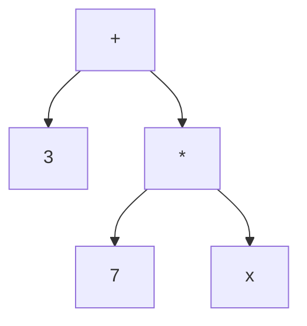

## 4.1 Precedence
- Expressions can be composed recursively
- Make sure attributes match as you wish
	- It helps to annotate each subexpression, showing the attributes of its resulting relation
- Parentheses and precedence rules define the order of evaluation
- Precedence from highest to lowest is
	- $\sigma$, $\Pi$, $\rho$, $\times$. $\bowtie$, $\cap$, $\cup$, $-$
- Unless very sure use brackets

**Breaking down Expressions**
- Complex nested expressions can be hard to read
- 2 Alternative notations allow us to break them down:
	1. Expression trees
	2. Sequences of assignment statements

**Expression Trees**
- Leaves are relations
- Interior notes are operators
- Exactly like representing arithmetic expressions as trees
- Ex. 3 + 7 * x:

## 4.2 Assignment Operator
- **Notation**:
	- $R(A_1, ..., R_2) := \text{Expression}$ 
	- Lets you name all the attributes of the new relation
	- Sometimes you don't want the name they would get from the Expression
	- But we'll specify the names even if they aren't changing, Great for readability.
- $R$ must be a temporary variable, not one of the relations in the schema
	- You are not updating the content of a relation!
- Example:
	- CSoffering(oid, dept, cnum, term, instructor) := $\sigma_{dept = 'csc'}$ Offering
	- TookCS(sid, grade) := $\Pi_{sid, grade}$(CSoffering $\bowtie$ Took)
	- PassedCS(sid) := $\Pi_{sid} \sigma_{grade \gt 50}$(TookCSC)
- Whether / how small to break things down is up to you. Its all for readability

## 4.3 Rename Operation
- **Notation**: $\rho_{R_1}(R_2)$ 
- Alternate notation: $\rho_{R_1(A_1,..,An)}(R_2)$
	- Lets you rename all the attributes as well as the relation
- Note that these are equivalent:
	- $R_1 := \rho_{R_1(A_1,...,A_n)}(R_2)$
	- $R_1 := \rho_{R_1(A_1,...,A_n)}(R_2)$
- $\rho$ is useful if you want to rename *within* an expression

## 4.4 Summary of Operators
| Operation | Name | Symbol |
| ---- | ---- | ---- |
| choose rows | select | $\sigma$ |
| choose columns | project | $\Pi$ |
| combine tables | Cartesian product natural join theta join | $\times$ $\bowtie$ $\bowtie_{condition}$ |
| rename relation (and attributes) | rename | $\rho$ |
| assignment | assignment | := |
**Syntactic Sugar**
- Some operations are not necessary
	- You can get the same effect using a combination of other operations
- Examples: natural join, theta join
- We call this "syntactic sugar"
- This concept also comes up in logic and programming languages

## 4.5 Set Operations
- Because relations are sets, we can use set intersection, union and difference
- But only if the operands are relations over the same attributes (in number, name and order)

**Quick Recap about Sets in Math**
1. **Union**:  {55, **22**, **48**, 74} ∪ {**22**, 23, **48**, 9, 50}  = {55, **22**, **48**, 74, 23, 9, 50}  
2. **Intersection**: {55, **22**, **48**, 74} ∩ {**22**, 23, **48**, 9, 50}  = {**22**, **48**}  
3. **Difference**: {55, **22**, **48**, 74} - {**22**, 23, **48**, 9, 50}  = {55, 74}  

- Set operators work the same way in relational algebra.

## 4.6 Expressing Integrity Constraints
- We’ve used this notation to expression inclusion dependencies between relations $R_1$ and $R_2$: $R_1 [X] ⊆ R_2 [ Y]$  
- We can use RA to express other kinds of integrity constraints.  
- Suppose $R$ and $S$ are expressions in RA. We can write a constraint in either of these ways: 
	- $R = ∅$
	- $R ⊆ S$ (equivalent to saying $R - S = ∅$)  

## 4.7 Summary of Techniques for Writing Queries in Relational Algebra

**How to Prepare to Solve a Problem**
1. Understand the question.  
2. Figure out which relations are relevant.  
3. Make a small instance of those relations that is a good test of the query. Write it down.  
4. Write down the schema for the answer.  
5. Write down the contents for the correct answer for your tests instance of the database.

**How to Work out the Solution**
1. Is there an intermediate relation that would help?  
	- Draw it out with actual data in it.  
2. Write the LHS for that intermediate relation.  
	- Give it a meaningful name.  
	- Name the attributes on the LHS, so you don’t forget what you have in hand.  
	- Add a comment explaining exactly what’s in the relation.  
2. Is there an intermediate relation that would help you define that one? Continue working backwards.  
4. Now write the algebra for all the RHSs.

**Don't Forget these Basics**
- Every time you combine relations, confirm that  
	- attributes that should match will be made to match and 
	- attributes that will be made to match should match.  
- Annotate each subexpression, to show its attributes.  
- Decisions are made one tuple at a time.  
	- If you need info from two different tuples, you must make a new relation where it’s in one tuple.  
- Sometimes you cannot assemble a tuple with evidence that an entity belongs in the answer.  
	- Then assemble evidence of what does not belong.  
	- Use set difference to get its complement!

**Specific Types of Query**
- “Max" (min is analogous):  
	- Pair tuples and find those that are not the max.  
	- Then subtract from all to find the maxes.  
- “k or more”:  
	- Make all combos of k different tuples that satisfy the condition.  
- “exactly k”:  
	- “k or more” - “(k+1) or more”.  
- “every”:  
	- Make all combos that should have occurred.  
	- Subtract those that did occur to find those that didn’t always. These are the failures.  
	- Subtract the failures from all to get the answer.

## 4.8 Relational Algebra Wrap-Up
**RA is Procedural**
- An RA query itself suggests a procedure for constructing the result (i.e., how one could implement the query).  
- We say that it is “procedural.”  

**Evaluating Queries**
- Any problem has multiple RA solutions.  
	-  Each solution suggests a “query execution plan”.  
	-  Some may seem a more efficient.  
- But in RA, we won’t care about efficiency; it’s an algebra.  
	- In a DBMS, queries actually are executed, and efficiency matters.  
- Which query execution plan is most efficient depends on the data in the database and what indices you have.  
	- Fortunately, the DBMS optimizes our queries.  
	- We can focus on what we want, not how to get it.

**Relational Calculus**
- Another abstract query language for the relational model.  
- Based on first-order logic.  
- RC is “declarative”: the query describes what you want, but not how to get it.  
- Queries look like this:  `{ t ⎢ t ε Movies ∧ t[director] = “Scott” }`  
- Expressive power (when limited to queries that generate finite results) is the same as RA. It is “relationally complete.”  