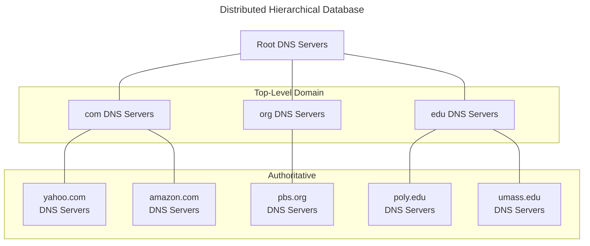

**DNS**: Domain Name System

**Internet Hosts, Routers**:
- IP address (32-bit) used for addressing datagrams
- "name", e.g., www.yahoo.com used by humans
Q: How to map between IP addresses and names?

- Should first find the IP address of the DNS server that has the mapping

## 9.1 DNS Definition
- Distributed database implemented in hierarchy of many name servers
- Application-layer protocol host, routers, name servers to communicate to resolve names (address/name translation)
	- Note: Core Internet function, implemented as application-layer protocol
	- Port #: 53
	- Complexity at network's "edge"

**Why not Centralized DNS?**
- Single point of failure
	- Vulnerable
- Traffic volume would be high
	- All requests go to the same place
- Maintenance would be challenging
	- Any change in a network should be tracked
- The centralized solution *doesn't scale!*

## 9.2 DNS Services
- Hostname to IP address translation
	- Ex. www.comm.utoronto.ca $\rightarrow$ 128.100.11.60
- Host aliasing
	- Canonical, alias names
	- Ex. alpha.comm.utoronto.ca might be a canonical name for www.comm.utoronto.ca
- Mail server aliasing
	- Ex. bob@yahoo.com requires mapping yahoo.com to a mail server IP address
- Load distribution
	- Replicated Web servers: set of IP addresses for one canonical name
	- Ex. www.google.com might be resolved to a different IP address closest to the client

- Client wants IP for www.amazon.com; 1st approximate:
	- Client queries a root server to find com DNS server
	- Client queries com DNS server to get amazon.com DNS server
	- Client queries amazon.com DNS server to get IP address for www.amazon.com

## 9.3 Root Name Servers
- Contacted by local name server that cannot resolve name
- Root name server:
	- Contacts authoritative name server if name mapping not known
	- Gets mapping
	- Returns mapping to local name server

## 9.4 TLD and Authoritative Servers
**Top-Level Domain (TLD) Servers**:
- Responsible for com, org, net, edu, etc, and all top-level country domains uk, fr, ca, jp
- Network Solutions maintains servers for com TLD
- Educase for edu TLD

**Authoritative DNS Servers**:
- Organization's DNS servers, providing authoritative hostname to IP mappings for organization's servers (e.g., Web, mail)
- Can be maintained by organization or service provider

## 9.5 Local Name Server
- Does not strictly belong to hierarchy
- Each ISP (residential IP, company, university) has one
	- Also called "default name server"
- When host makes DNS query, query is sent to its local DNS server
	- Acts as proxy, forwards query to hierarchy

**Iterated Query**:
- Contacted server replies with name of server to contact
- "I don't know this name but ask this server"

**Recursive Query**:
- Puts burden of name resolution on contacted name server
- Heavy load?

## 9.6 DNS Caching
- Once (any) name server learns mapping it *caches* mapping
- Cache entries timeout (disappear) after some time
- TLD servers typically cached in local name servers
	- Thus root name servers not often visited

## 9.7 DNS Records
**DNS**: Distributive db storing resource records (RR)
`RR Format: (name, value, type, ttl)`

1. **Type = A**
	- `name` is hostname
	- `value` is IP address
2. **Type = NS**
	- `name` is domain (e.g. foo.com)
	- `value` is hostname of authoritative server for this domain
3. **Type = CNAME**
	- `name` is alias name for some "canonical" (the real) name
	- www.ibm.com is really servereast.backup2.ibm.com
	- `value` is canonical name
4. **Type = MX**
	- `value` is name of mail server associated with `name`

## 9.8 DNS Protocol, Messages
**DNS Protocol**: Query and reply messages both with same message format

**Message Header**:
- Identification: 16 bit number for query, reply to query uses same number
- Flags:
	- Query or reply
	- Recursion desired
	- Recursion available
	- Reply is authoritative

- DNS uses UDP as the transport protocol
## 9.9 Examples
1. Suppose within your web browser you click on a link to obtain a web page. The IP address is not cashed and the root, TLD, and authoritative servers should all be visited to resolve the IP address. Assume that the one-way propagation delay between your computer and the local DNS server is 1 msec and the one-way propagation delay in the internet is 5 msec. Assume that the web page you are fetching has one image located on a different server in the same company. How long does it take to resolve the IP address of the web page and all objects?
	- Only to resolve IP address
$$
\begin{gathered}
	\text{time to resolve IP of the main page: 1 + 10 + 10 + 10 + 1 = 32} \\
	\text{time to resolve IP of the image: 1 + 10 + 1 = 12} \\
	\text{total time: 44 msec}
\end{gathered}
$$
2. Consider the 2 statements:
	1. Two DNS requests for the same website that are 1 second apart always have the same address resolution time.
	2. DNS uses a client-server paradigm.
Ans: Statement 1 is false and statement 2 is true

3. Inserting records into DNS: New startup “Network Utopia”
	- Register name networkuptopia.com at DNS registrar (e.g., Network Solutions)
		- Provide names, IP addresses of authoritative name server (primary and secondary)
		- Registrar inserts two RRs into com TLD server: 
		`(networkutopia.com, dns1.networkutopia.com, NS) (dns1.networkutopia.com, 212.212.212.1, A)` 
	- Create authoritative server Type A record for www.networkuptopia.com; Type MX record for networkutopia.com