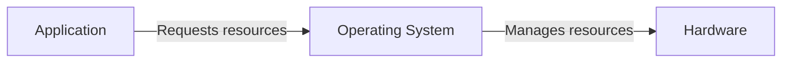

- An operating system manages resources:


- There are 3 core operating system concepts:
	1. **Virtualization**: Share one resource by mimicking multiple independent copies.
	2. **Concurrency**: Handle multiple things happening at the same time.
	3. **Persistence**: Retain data consistency even without power.

**Program**: A file containing all the instructions and data required to run.

**Process**: An instance of a running program. 3 basic requirements for a process:
	1. Virtual registers
	2. Stack
	3. Heap
- The stacks for each process need to be in physical memory

**Instruction Set Architecture (ISA)**: Its the machine code or numbers the CPU understands. 3 major ISAs in use today:
	1. x86-64 (aka amd64): For desktops, non-Apple laptops, servers
	2. arch64 (aka arm64): For phones, tablets, Apple laptops
	3. riscv (aka rv64gc): Open-source implementation, similar to ARM

**Inter-process Communication (IPC)**: Transferring data between 2 processes. Since processes are independent, we need an explicit way to transfer data like file descriptors.

**File Descriptor**: A resource that users may either read bytes from or write bytes to (identified by an index stored in a process). Can represent a file or your terminal.
- By convention there are some expected file descriptors:
	0. Standard input (read)
	1. Standard out (write)
	2. Standard error (write)

- *System calls* make requests to the operating system, can be represented like regular C functions

```c 
ssize_t write(int fd, const void *buf, size_t count);
```
- Writes bytes from a byte array to a file descriptor
- ```fd``` - The file descriptor
- ```buf``` - The address of the start of the byte array (called *buffer*)
- ```count``` - The exit status code (0-255)

```c
void exit_group(int status);
```
- Exits the current process and sets an exit status code
- ```status``` - The exit status code (0-255)

**Application Programming Interface (API)**: Abstracts the details and describes the arguments and return value of a function. Tells you what. Ex. A function that takes 2 integer arguments

**Application Binary Interface (ABI)**: Specifically the details, how to pass arguments and where the return value is. Tells you how. Ex. The same function using the C calling convention.

- System calls use registers while C is stack based:
	- Arguments are pushed on the stack from right-to-left order
	- `rax`, `rcx`, `rdx` are caller saved
	- Remaining registers are callee saved
	- Some arguments may be passed in registers instead of the stack

- Programs on Linux use the ELF file format
	- Executable and Linkable Format (ELF) specifies both executables and libraries
	- Always starts with the 4 bytes: `0x7F 0x45 0x4C 0x46` or with ASCII encoding: DEL 'E' 'L' 'F'
	- These 4 bytes are called "magic" and that is how you know what kind of file this is (other file formats may have a different number of bytes)

**Kernel**: A core part of your operating system. The part of your OS that runs in kernel mode, interacts with hardware.
- These instructions allow only trusted software to interact with hardware
- Different types of kernels:
	- Monolithic Kernel: Runs operating system services in kernel mode
	- Microkernel: Runs the minimum amounts of services in kernel mode (Ex. Filesystems, device drivers, advanced IPC in user mode)
	- "Hybrid" Kernels: Are between monolithic and microkernels
	- Nanokernels and picokernels move more services in user mode than microkernel

**Kernel Mode**: Is a privilege level on your CPU that gives access to more instructions.

- More privileged CPU modes can access more instructions

| CPU Mode | Software |
| ---- | ---- |
| U-Mode (User) | Application, libraries |
| S-Mode (Supervisor) | Kernel |
| H-Mode (Hypervisor) | Virtual Machines |
| M-Mode (Machine) | Boot loader, firmware |
- System calls transition from user and kernel mode
- System calls are traceable; can trace all the system calls a process makes on Linux using ```strace <PROGRAM>```

- You can think of the kernel as a long running process
	- Writing kernel code is more like writing library code (there's no main)
	- The kernel lets you load code (called modules)
	- Your code executes on-demand
		- Ex. when it is loaded manually, new hardware, or accessing a certain file
	- If you write a kernel module you can execute privileged instructions and access any kernel data, so you can do anything

- System calls are rare in C
	- Mostly you will be using functions from the C standard library instead
	- Most system calls have corresponding function calls in C but may:
		- Set `errno`
		- Buffer reads and writes (reduce the number of system calls)
		- Simplify interfaces (function combines 2 system calls)
		- Add new features
- C `exit` has additional features
	- System call for `exit` or `exit_group`: the program stops at that point
	- There is a feature to register functions to call on program exit (`atexit)
