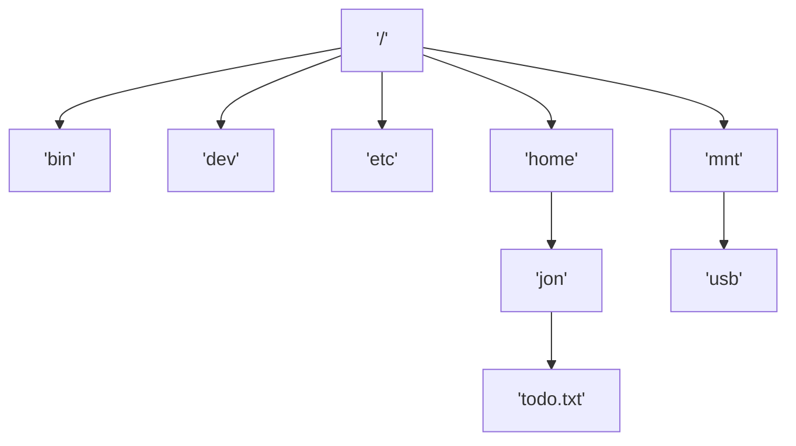

### 1. POSIX Filesystem

- Working Directory: `/home/jon`
- `todo.txt` Relative: `./todo.txt`  
- `todo.txt` Absolute: `/home/jon/todo.txt`  
- `usb` Relative: `../../mnt/usb`  
- `usb` Absolute: `/mnt/usb`  
Special symbols:
- `.` — Current directory  
- `..` — Parent directory  
- `~` — User’s home directory (`$HOME`)  

- Relative paths are calculated from current working directory (`$PWD`)
- You can access files sequentially or randomly

**Sequential access:**
- Each read advances the position inside the file
- Writes are appended and the position is set to the end afterward
**Random access:**
- Records can be read/written to the file in any order
- A specific position is required for each operation
#### 1.1 POSIX Filesystem APIs
```c
int open(const char *pathname, int flags, mode_t mode);
// flags can specify which operations: O_RDWR,O_WRONLY, O_RDWR 
// also: O_APPEND moves the position to the end of the file initially

off_t lseek(int fd, off_t offset, int whence);
// lseek changes the position to the offset 
// whence can be one of: SEEK_SET, SEEK_CUR, SEEK_END 
// set makes the offset absolute, cur and end are both relative

```
#### 1.2 Directory API
```c
DIR *opendir(char *path); // open directory 
struct dirent *readdir(DIR *dir); // get next item 
int closedir(DIR *dir); // close directory 

void print_directory_contents(char *path) { 
	DIR *dir = opendir(path); 
	struct dirent *item; 
	while (item = readdir(dir)) { 
		printf("- %s\n", item->d_name); 
	} 
	closedir(path); 
}
```

- Each process contains a File Table in its PCB
	- A File Descriptor is an index in the table 
	- Each item points to a system-wide global open file table 
	- The GOF table holds information about the seek position and flags 
		- It also points to a VNode (supports read/write/etc) 
	- A vnode (virtual mode) holds information about the file 
		- vnodes can represent regular files, pipes, network sockets, etc.
- Remember what happens in a fork
	- PCB is copied on fork
	- Specifically for us, the local open file table gets inherited 
	- Both PCBs point to the same Global Open File Table entry
- There are some “Gotchas” for this sharing
	- File position is shared between processes
	- `lseek()` in one process affects the other
	- Opening the same file _after_ forking creates separate GOF entries
### 2. Contiguous Allocation
- Contiguous allocation is fast, if there are no modifications
- Space efficient: Only start block and # of blocks need to be stored
- Fast random access: block = floor( offset/blocksize )
- Files can not grow easily
	- Internal fragmentation (may not fill a block)
	- External fragmentation when files are deleted or truncated
### 3. Linked Allocation
- Linked allocation has slow random access
- Space efficient: Only start block needs to be stored
	- Blocks need to store a pointer to the next block (block is slightly smaller)
- Files can grow/shrink
	- No external fragmentation 
	- Internal fragmentation
- How can we increase random access speed? We need to walk each block
	- Each block may be located far away (it will never be cached)
### 4. File Allocation Table (FAT)
- Similar to Linked Allocation
- File Allocation Table moved the list to a separate table
- Files can grow/shrink
	- No external fragmentation
	- Internal fragmentation
- Fast random access: FAT can be held in memory/cache
	- FAT size is linear to disk size: can become very large
### 5. Indexed Allocation
- For Indexed Allocation, each file needs an index block
- Files can still grow/shrink
	- No external fragmentation 
	- Internal fragmentation
- Fast random access 
- File size limited by the maximum size of the index block (fit it in one block)