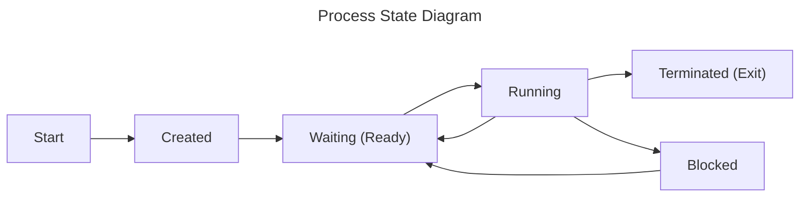

### Table of Contents
[[Processes#1. Background |1. Background]]
[[Processes#2. Creating Processes|2. Creating Processes]]
[[Processes#3. Parent-Child Relationship|3. Parent-Child Relationship]]
[[Processes#4. Inter-Process Communication|4. Inter-Process Communication]]
## 1. Background
**Process**: Is an instance of a running program.
- Each process has its own address space (independent view of memory)

**Process Control Block (PCB)**: Contains all information about a process. It contains:
- Process state
- CPU registers
- Scheduling information
- Memory management information
- I/O status information
- Any other type of accounting info

- Each process gets a unique **process ID (PID)** to keep track of it
- You can read process state using the "proc" filesystem ```\proc\<PID>\status```
	- R: running and runnable (running and waiting)
	- S: interruptible sleep (blocked)
	- D: uninterruptible sleep (blocked
	- T: stopped
	- Z: zombie

**Context Switching**: Swapping processes. Is *pure overhead*, we want it to be as fast as possible
- At minimum save all current registers
## 2. Creating Processes
- We can create processes from scratch by loading the program into memory and create the process control block (what Windows does)
- Instead of creating a new process, could clone it:
	- Pause currently running process, copy its PCD into a new one
	- Will reuse all of the information from the process including variables
	- Distinguish between the 2 process with a *parent and child relationship*

```c
int fork(void);
```
- ```fork``` - Creates a new process, a copy of the current one
	- Returns the process ID of the newly created child process
		-1: on failure
		0: in the new child process
		\> 0: in the parent process
	- We do not know which process (child or parent) will run first
	- Note: they can access the same variables but they are *separate*, operating system does copy on write to maximize sharing

- On Linux ```init``` (PID 1) is the first created process, all processes stem from it
- On POSIX systems can find documentation on commands and functions using ```man <number><function>```

- ```execve``` - Replaces the process with another program and resets. Has the following API:
	- ```pathname``` - Full path of the program load
	- ```argv``` - Array of strings (array of characters), terminated by a null pointer. Represents arguments to the process
	- ```envp``` - Same as argv. Represents the environment of the process
	- Returns an error on failure, does not return if successful
- More convenient API:
```c
int execlp(const char* file, const char* arg, NULL);
```

- ```htop``` - Use to see your process tree, press F5 to switch between tree and list view

## 3. Parent-Child Relationship
- The parent process is responsible for its child
	- The operating system sets the exit status when a process terminates (the process terminates by calling *exit*) but does not remove its PCB yet
	- The *minimum acknowledgement* the parent has to do is *read* its exit status (must call ```wait``` or ```waitpid```)
	- Operating system may *interrupt* parent to acknowledge its child using a signal ```SIGCHILD```

- There are 2 possible situations:
	1. **Zombie Process**: Child exits before the parent
		- Waits for its parent to read its exit status since has not been acknowledged yet
		- A process may have an error in it where it never reads the child's exits status
		- Has to be kept until acknowledged, if the parent ignores it the zombie process needs to be re-parented
	2. **Orphan Process**: Parent exits before the child
		- Needs a new parent since the child lost its parent
		- Needs a parent to acknowledge it when it exits
- If re-parenting is needed, the operating system re-parents the child process to ```init```

- ```wait``` has the following API:
	- ```status``` - address to store the wait status of the process
		- Contains a bunch of information including the exit code
	- Returns the process ID of the child process
		- -1 on failure
		- 0 for non blocking calls with no child changes
		- >0 the PID of child with a change
- ```waitpid``` - wait on a specific child process
	- ```WNOHANG``` - to turn waitpid into nonblocking call

- ```pidof``` - Find a process' ID

## 4. Inter-Process Communication
**Inter-Process Communication (IPC)**: Transferring bytes between 2 or more processes

**Signals**: Are a form of IPC that interrupts
- Kernel default handlers either ignore the signal or terminate your process
- If the default handler occurs the exit code will be 128 + signal number 
- Can set your own signal handlers with ```sigaction```
	- You just declare a function that doesn't return a value and has an int argument - the integer is the *signal number*
- A signal pauses your process and runs the signal handler

- Some numbers are non-standard, below are a few from Linux x86-64
	- 2: SIGINT (interrupt from keyboard)
	- 9: SIGKILL (terminate immediately)
	- 11: SIGSEGV (memory access violation, segmentation fault)
	- 15: SIGTERM (terminate)

- ```kill <signal number>``` - command to send a signal

**Interrupt**: Triggered by external hardware, handled by the kernel (needs to respond quickly)

**Exception**: Triggered by an instruction (divide by 0, illegal memory access), default handler is the kernel (calling process suspended), the process can optionally handle some of these themselves

**Trap**: Transfer control to a trap handler caused by either an exception or an interrupt (code that runs)
- System call would be a requested trap

```c
int pipe(int pipefd[2]);
```
- ```pipe``` - Kernel manage buffer where any data written to 1 end can be read at the other, forms a one-way communication channel using 2 file descriptors
	- Returns 0 on success and -1 on failure (sets ```errno```)
	- ```pipefd[0]``` is the read end of the pipe
	- ```pipefd[1]``` is the write end of the pipe

```c
int dup(int oldfd);
```
- Returns a new file descriptor on success and -1 on failure (sets ```errno```). Copies old file descriptor
- Will return the lowest file descriptor available

```c
int dup2(int oldfd, int newfd);
```
- Copies the file descriptor so oldfd and newfd refer to the same thing
- It will automatically close newfd argument if open and make it refer to what old fd refers to