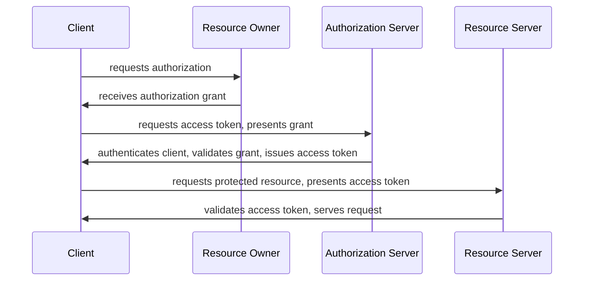

### 1. Definitions
**OAuth**: Stands for "Open Authorization" and is a standard designed to allow a website or application access resources hosted by other web apps on behalf of a user
- Is the industry standard protocol for authorization
- OAuth 2.0 replaced OAuth 1.0 in 2012
- Focuses on client developer simplicity while providing specific authorization flows

**OAuth 2.0 Bearer Token Usage**: A Bearer Token is an opaque string, not intended to have any meaning to clients using it. Some servers will issue tokens that are a short string of hexadecimal characters, while others may use structured tokens such as JSON Web Tokens.

#### 1.1 OAuth 2.0 Flow Diagram

### 2. Implementation
#### 2.1 Mandatory Parameter Values
1. Client ID
2. Client Secret
3. Client Type
4. Grant Type
5. Scope
6. Client Authorization
*Scope and Client Authorization may vary according to the application*

- Can use GET, POST, PUT, PATCH, DELETE actions to communicate between applications